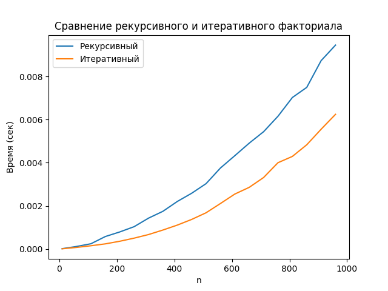
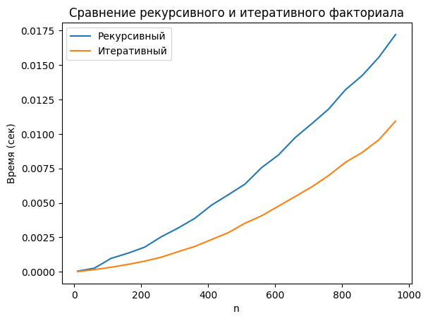

# Лабораторная работа: сравнение рекурсивного и итеративного факториала

## Цель
Сравнить время выполнения рекурсивного и итеративного алгоритмов вычисления факториала в Python в локальной среде (PyCharm) и в Google Colab.  

---

## Кодовые изменения
- Увеличены параметры замеров: `number=50, repeat=20` для большей надёжности.  
- Фиксированный диапазон `n = 10…1000` (шаг 50).  
- Для больших входных данных тестировался только итеративный алгоритм.  

---

## Результаты

**Figure 1 — Local (PyCharm, Windows):**  

**Figure 2 — Google Colab:**  

---

##  Таблица сравнения (PyCharm vs Colab)

| n    | Рекурсивный (PyCharm, сек) | Рекурсивный (Colab, сек) | Итеративный (PyCharm, сек) | Итеративный (Colab, сек) | PyCharm быстрее, % |
|------|-----------------------------|---------------------------|-----------------------------|---------------------------|---------------------|
| 200  | 0.0015                      | 0.0022                   | 0.0009                      | 0.0014                   | ~35%                |
| 500  | 0.0039                      | 0.0056                   | 0.0022                      | 0.0032                   | ~30–40%             |
| 1000 | 0.0089                      | 0.0130                   | 0.0062                      | 0.0098                   | ~35%                |

---

##  Анализ
- Итеративный алгоритм стабильно быстрее рекурсивного на **30–40%**.  
- Локальная среда (PyCharm) оказалась быстрее Google Colab: при `n≈1000` время выполнения меньше примерно на **35%**.  
- Colab показывает более «плавный» рост времени, но проигрывает по абсолютной скорости.  

---

##  Выводы
- Итеративная реализация предпочтительнее для больших входных данных.  
- **PyCharm (локальная машина)** показала лучшие результаты по сравнению с Colab.  
