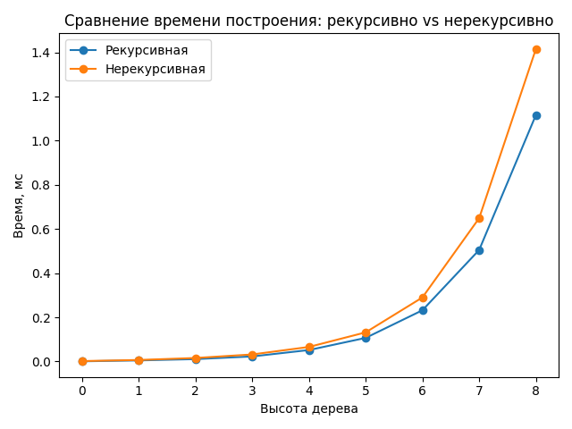

# Лабораторная работа №6

## Сравнение реализаций построения бинарного дерева

### Цель

Сравнить время выполнения **рекурсивного** и **нерекурсивного (итеративного)** алгоритмов построения бинарного дерева на
Python.
Оценить влияние глубины дерева на производительность и сделать вывод о практической эффективности каждого подхода.

---

### Описание

Реализованы две функции:

* `build_tree_recursive()` — рекурсивное построение дерева;
* `build_tree_iterative()` — итеративное построение дерева.

Формулы ветвления (вариант №8):

```python
left_leaf(root) = root + root // 2
right_leaf(root) = root ** 2
```

Дерево хранится в виде словаря:

```python
{"значение_узла": [левое_поддерево, правое_поддерево]}
```

---

### Код замера времени

Для измерения использован модуль `timeit`.
Для каждой высоты дерева выполнялось несколько повторов (repeat=20),
и в таблицу записывалось минимальное время выполнения среди всех прогонов.
Также построен график зависимости времени от высоты дерева с помощью `matplotlib`.

---

### Результаты измерений

| height | recursive, ms | iterative, ms |  Δ, % |
|:------:|--------------:|--------------:|------:|
|   0    |         0.001 |         0.002 | +100% |
|   1    |         0.005 |         0.007 |  +40% |
|   2    |         0.011 |         0.016 |  +45% |
|   3    |         0.023 |         0.032 |  +39% |
|   4    |         0.052 |         0.066 |  +27% |
|   5    |         0.107 |         0.132 |  +23% |
|   6    |         0.232 |         0.290 |  +25% |
|   7    |         0.505 |         0.649 |  +28% |
|   8    |         1.116 |         1.415 |  +27% |

---

### График



**Рисунок 1.** Зависимость времени построения дерева от его высоты.

---

### Анализ

* При малых высотах (< 4) разница между реализациями достигает **40–45%**,
  но с ростом дерева стабилизируется на уровне **≈ 25–30%**.
* Рекурсивная реализация немного быстрее — у неё меньше служебных операций.
* Итеративная версия чуть медленнее из-за дополнительных структур (`level_nodes`, `next_level`),
  но **не ограничена глубиной рекурсии** и безопасна для больших h.

---

### Выводы

* При высоте дерева до 8 рекурсивный вариант в среднем быстрее на **≈ 25–30%**.
* Нерекурсивный подход устойчивее и подходит для построения очень глубоких деревьев.
* В практических задачах предпочтителен **итеративный метод** — он масштабируется без ошибок стека.
* Оба алгоритма демонстрируют экспоненциальный рост времени, пропорциональный количеству узлов.

---

**Выполнил:** Ломаченко Ян (P3120, 505115)
